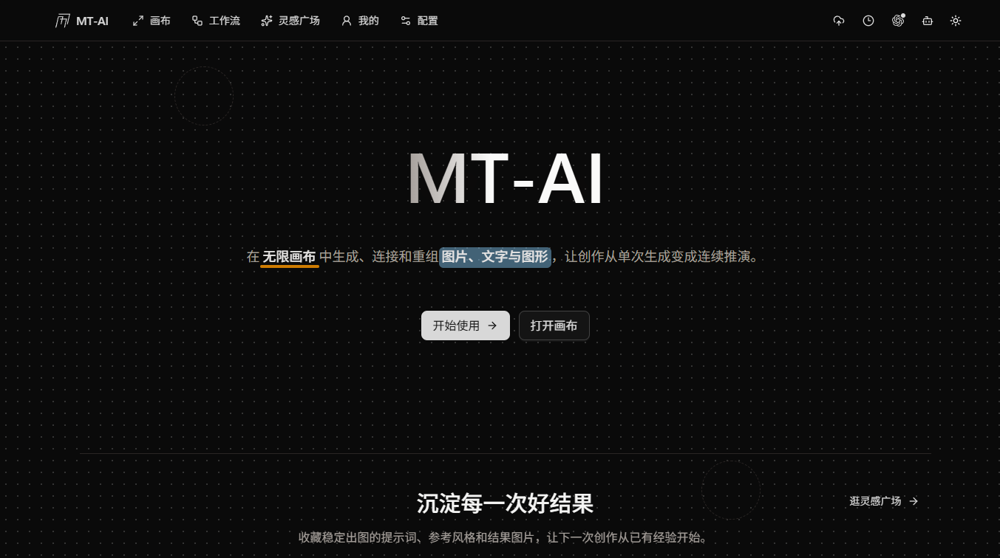

<p align="center">
  
</p>

<h1 align="center">MT-AI</h1>

<p align="center">把 AI 图片生成变成可以连续推演的设计过程</p>

<p align="center">
  <a href="https://render.com/deploy?repo=https://github.com/HAE8939/MT-AI"></a>
  <a href="LICENSE"></a>
  <a href="https://vite.dev/"></a>
  <a href="https://react.dev/"></a>
</p>

<p align="center">
  <a href="docs/content/docs/overview/quick-start.mdx">快速开始</a> ·
  <a href="docs/content/docs/overview/features.mdx">功能介绍</a> ·
  <a href="docs/content/docs/canvas/canvas-node-manual.mdx">画布操作手册</a> ·
  <a href="docs/content/docs/canvas/canvas-shortcuts.mdx">快捷键</a> ·
  <a href="canvas-agent/README.md">本地 Canvas Agent</a> ·
  <a href="plugins/mt-ai">Codex 插件</a> ·
  <a href="SECURITY.md">漏洞提交</a>
</p>

<p align="center">
  
</p>

---

MT-AI 是一款开源的无限画布 AI 创作工作台，主要面向**建筑 / 室内 / 景观设计**的视觉工作流。传统 AI 生图是「输入提示词 → 出图 → 结束」的单发过程；MT-AI 把生成、参考、编辑、对比全部放在一张可连线的画布上——每张图都是节点，每次迭代都有来路，方案推演的整条路径都被保留下来。

前端纯静态、无后端：API Key 与画布数据保存在浏览器本地，AI 请求由浏览器直连你配置的接口。开箱即是你自己的私有工作台。

> [!CAUTION]
> 项目处于快速开发阶段，本地存储格式可能直接调整、不保证历史数据兼容。适合个人 / 本地部署。

## 特色

- 🎨 **画布即工作流** —— 文本、图片、视频、音频、生成配置、组，六类节点自由连线；参考图、提示词、生成参数都在画布上组织，多方案并行推演、随时回溯。
- 🏠 **为设计行业准备的弹药库** —— 灵感广场内置 100+ 条室内行业提示词（SU 转写实、室内效果图、建筑外观、景观规划、商业空间等九大类），配套图纸转写实、多角度、360° 全景、局部重绘等场景化工具。
- 🧩 **结构化提示词工作台** —— 移植自 DMDS 的提示词生成器：卡片 → 键 → 标签三级结构，点选标签实时组合出 JSON 提示词，画布侧栏一键填入节点；AI 分析结果里的 JSON 还能反向「结构化」为可点选卡片，微调后回填——提示词从一段文字变成可复用的零件。
- 🤖 **AI 能直接操作画布** —— 本地 Canvas Agent 通过 MCP 注册 28 个工具，接入 Codex / Claude Code 后，对话即可导航页面、增删节点、触发生成、检索提示词与素材。
- ☁️ **云工作流接入** —— 登记 RunningHub 工作流（粘贴导出 JSON 自动识别参数），画布侧栏直接运行 ComfyUI 级别的云端管线，结果自动写回画布节点。
- 🔗 **本地自建工作流** —— 把画布上跑通的多步本地生成（文生图 → 参考图编辑 → 放大…）选中「保存为本地工作流」并标记输入槽，运行时填素材一键按依赖顺序自动串跑，不依赖云端（v1 图片链）。
- 🔒 **本地优先** —— 数据存 IndexedDB，媒体可选腾讯云 COS 同步队列；`config.json` 支持管理员级配置下发，团队部署时渠道配置自动同步到所有设备。

## 模块导览

主导航五个模块：**画布 / 工作流 / 灵感广场 / 我的 / 配置**。

### 🖼️ 画布

创作主战场，画布节点是唯一生成入口。

- 多画布项目、组节点、节点命名、小地图、撤销重做、快捷键、zip 导入导出、一键整理。
- 文生图、图生图、参考图编辑（可标注风格 / 构图 / 色彩 / 材质用途）、文本问答、视频生成（Seedance 2.0 支持多参考图 / 视频 / 音频）、TTS 音频。
- 图片工具箱：双图滑杆对比、360° 全景查看与生成、非破坏性标注、裁剪、行列切图、局部重绘（比例选区 + 羽化 + 附加参考图）、多角度生成（three.js 相机预览）、反推提示词。
- 侧栏三合一：**对话**（项目模型 / 本地 Codex 双引擎）、**工作流**（RunningHub 式运行面板）、**提示词**（组合模板点选直填）。
- 文档智能体：内置可增删改的分析角色，读取选中节点产出连接的分析文本节点。

### ⚙️ 工作流

- 登记 RunningHub 云工作流：workflowId + 参数映射，粘贴「导出工作流 API」JSON 自动识别图片与提示词参数；接口走 OpenAPI v2（Bearer 鉴权），内置「Z Image 亿级像素文生图」模板开箱即用。
- 画布多选节点可「保存为工作流模板」：保留生成参数骨架，插入任意画布换输入重跑。
- 画布多选生成步骤可「保存为本地工作流」：标记输入槽后，侧栏「工作流」标签填输入一键按依赖顺序自动串跑本地生成，结果写回画布（v1 图片链）。

### 💡 灵感广场

- 100+ 条室内行业提示词，按场景九大类组织，搜索 / 标签筛选 / 一键收藏。
- 「组合模板」分类收录 DMDS 式提示词生成器——「室内效果图组合工作台」六张卡片（空间类型 / 核心约束 / 场景与光效 / 材质控制 / 摄影参数 / 渲染精度），嵌套 JSON 实时预览。

### 📁 我的

- 收藏、我的提示词、素材、生成记录四个分区。
- 提示词编辑器：多卡片草稿（`*标签=实际值` 行语法）、任意 JSON 一键导入成卡片、「AI 增强」把简单描述改写为专业结构化提示词。
- 素材库：批量 / 拖拽导入、自动缩略图、挂载提示词、插入画布带出。
- 全量 JSON 导入导出，数据自己掌握。

### 🔧 配置

- 多渠道管理：OpenAI 兼容 / Gemini 调用格式自选，拉取模型列表；一键添加**东木-AI** 聚合平台（模型与能力自动发现）；火山方舟 Seedance、RunningHub 各自独立配置。
- 腾讯云 COS 媒体同步、本地 Codex Agent 连接、生成偏好，全部集中一页。

## 界面预览

<p align="center">
  
</p>

## 快速开始

### 1. 跑起来

```bash
cd web
bun install
bun run dev   # http://localhost:3000
```

Windows 用户可以直接双击根目录 `start-all.bat`，同时拉起本地 Agent 与网页服务并自动打开浏览器。

### 2. 配一个渠道

打开右上角配置（或 `/config` 页），填入 OpenAI / Gemini 兼容接口的 `Base URL` 和 `API Key`，拉取模型列表即可开始生成。

使用 **New API** 的话，在其 `系统设置 → 聊天方式` 中添加：

```text
https://你的部署地址?apiKey={key}&baseUrl={address}
```

跳转后自动写入渠道配置。团队部署可编辑 `web/public/config.json` 做管理员级配置下发。

### 3. 开始创作

新建画布 → 放一个文本节点写提示词（或从侧栏「提示词」tab 的组合模板点选生成）→ 生图 → 连线迭代。画布操作细节见 [节点操作手册](docs/content/docs/canvas/canvas-node-manual.mdx)。

## 部署

| 方式 | 说明 |
| --- | --- |
| 本地 | `bun run build` 产出 `web/dist` 纯静态文件，任意静态服务器可托管 |
| Render | 点击顶部徽章一键部署，配置见 [render.mdx](docs/content/docs/overview/render.mdx) |
| Vercel | 仓库自带 `vercel.json`，导入即用 |
| Docker | nginx 静态托管，见 [docker.mdx](docs/content/docs/overview/docker.mdx) |
| GitHub Pages | 推送版本 tag 自动发布（仓库 Pages 设置选 GitHub Actions） |

## 接入 Codex / Claude Code（可选）

让 AI 助手直接操作你的画布：

- **插件安装**：Windows 运行 `setup-codex.bat` 一键安装 Codex 插件（自动注册 MCP 并拉起本地 Agent）；或运行 `start-agent.bat` 启动 Agent 后在网页连接。
- **仅网页连接**：`npx -y @basketikun/canvas-agent` 直接运行 Agent——不安装 MCP、不增加 Codex token 消耗。
- **本地构建直连**（二次开发推荐）：`canvas-agent/` 下 `npm install && npx tsc -p tsconfig.json` 构建后，在 `~/.codex/config.toml` 注册：

  ```toml
  [mcp_servers.mt-ai]
  command = "node"
  args = ['<仓库路径>/canvas-agent/dist/index.js', "mcp"]
  startup_timeout_sec = 20
  tool_timeout_sec = 90
  ```

  本地构建与仓库网页版本完全同步（npx 已发布包可能落后）；源码更新后需重新构建并重启 Codex。

工具能力范围见 [Codex 能力清单](docs/content/docs/overview/codex-capabilities.mdx)，原理说明见 [本地 Codex 连接画布](docs/content/docs/overview/local-codex-canvas.mdx)。

## 技术栈与数据

- **前端**：Vite 7 · React 19 · TypeScript · Ant Design 6 · Tailwind 4 · Zustand 5，纯静态构建、无后端。
- **数据**：画布 / 提示词 / 素材 / 生成记录存浏览器 IndexedDB（localforage）；媒体文件可选腾讯云 COS 本地优先上传队列（自动重试 + 同步中心）。
- **AI 请求**：浏览器直连所配置的接口，API Key 不经过任何中转——也因此只适合个人或可信环境使用。

## 开源协议与致谢

本项目使用 GNU Affero General Public License v3.0，见 [LICENSE](LICENSE)。

本仓库是基于 [basketikun/infinite-canvas](https://github.com/basketikun/infinite-canvas) 的二次开发项目，感谢原作者的开源工作。作为 AGPL-3.0 衍生作品，本项目保留原作者版权声明与前端页面标识；与上游的详细差异、第三方数据来源和免责说明见 [NOTICE.md](NOTICE.md)。基于本仓库继续二次开发时，请同样保留上述信息。
